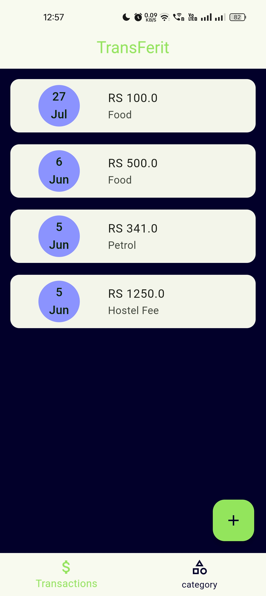
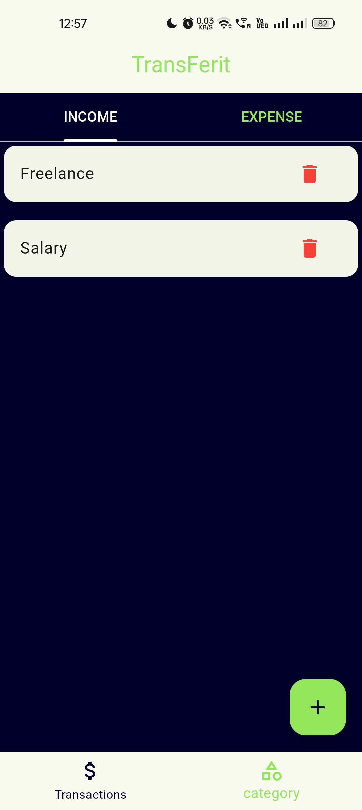
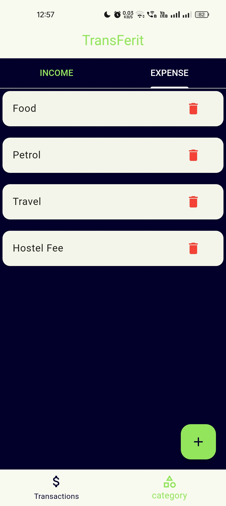
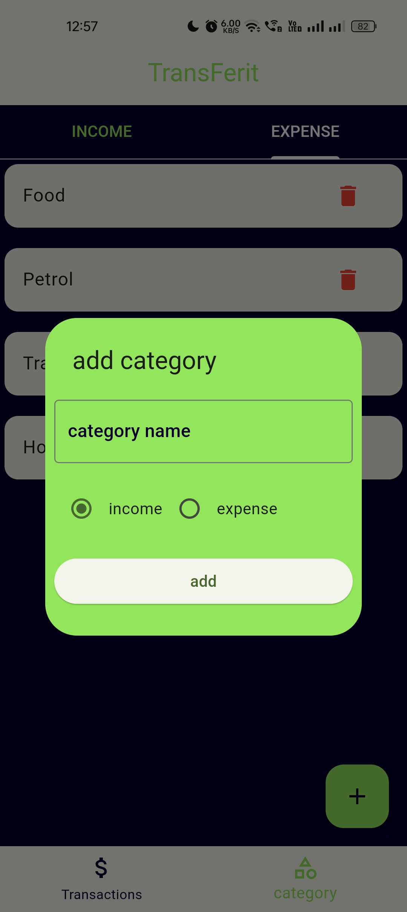
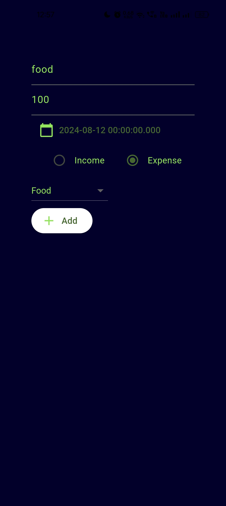

<h3>TranSFerit<h3> 

TransFerit is an intuitive expense tracking app designed to simplify financial management. With TransFerit, you can effortlessly log expenses and incomes and gain valuable insights into your spending habits. Ideal for personal use or small business tracking, TransFerit offers powerful features in an easy-to-use interface.

Below are some screenshots from the Money Management Application:

  
  
  
  
  

<h2>REPORT:<h2>
This report provides an in-depth analysis of the design decisions, architectural choices, and testing approach employed during the development of TranSFerit a Money Management Application using Flutter. The application allows users to manage their finances by adding transactions and categorizing them for better financial tracking and analysis.
      User Interface (UI) Design

    Simple and Intuitive Layout: The UI was designed to be user-friendly, allowing users to navigate the application with ease. The home screen provides quick access to essential features such as adding transactions and viewing categories.
    Consistent Design Language: A consistent design language was used throughout the application, employing Material Design principles to ensure that the app feels familiar to users of Android devices.
    Responsive Design: The UI components were designed to be responsive, ensuring a seamless experience across different screen sizes and orientations.
    
